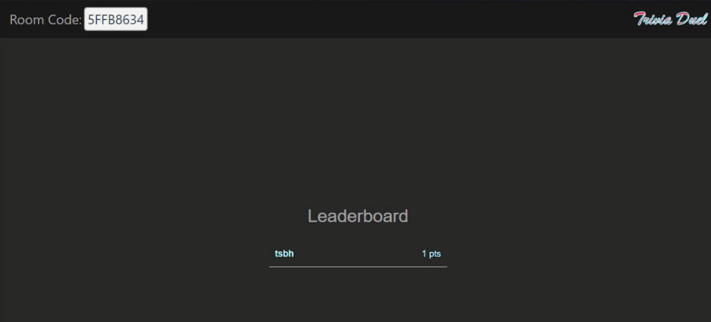

# Trivia Website

*Disclaimer: This website is not currently deployed, and may require paid features of Amazon Web Services.*

- This is a trivia website made using Vue 3, Vite, NodeJS and AWS.
- A player is able to create or join trivia rooms.
- In the rooms, a trivia game can be started.
- The players have a limited time to guess the correct trivia question from a group of 2 to 4 answers.

## AWS
- The infrastructure to run the game is contained within the CloudFormation YML document, ready for full deployment.
- The infrastructure includes:
    - Step functions
    - Lambdas
    - S3 bucket
    - VPC configurations
    - Redis Elasticache
    - API Gateway
        - HTTPS
        - Websockets
    - Secret Management
- Infrastructure graph:
    - 

## Front End
- The front end is created using Vue 3 and Vite (for building).
- There is a .env required that uses a VITE_API_URL value that should be the websocket URL for the frontend to hit to engage with the AWS infrastructure.

## Examples
- Landing page:
    - 

- Create or join a room:
    - 

- Waiting in a room:
    - 

- Question to answer:
    - 

- Leaderboard:
    - 
